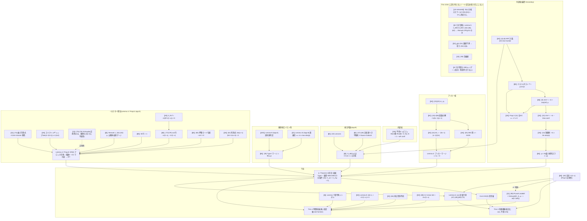

# L8 — v3 存在定理(Theorem 2)の依存グラフと認証の張り先検証

作成日: 2026-08-08。出典はすべて v3(arXiv:2606.22531v3)。
目的: **認証テストを「現在荷重を支えている量」に張り、撤回された量に張らない**
ことをグラフで検証可能にする(人間指示による Phase 0 前提作業 (3))。

## 0. 範囲と凡例

- 対象は **Theorem 2**(per-cut 存在: admissible accelerating warpshell)。
  時間発展 **Theorem 4** は依存が増えるため別レイヤとして明示する
  (新認証 C3c/C3d の張り先は Thm 4 側の荷重)。
- ノード種別:
  - **【W】閉形式証人** — 数値認証可能(pytest の張り先)
  - **【E】厳密恒等式** — 接合代数など、実装すれば恒等的に検証可能
  - **【S】構造定理** — Fredholm/IFT/剛性/Schauder 等。数値認証の対象外
    (証明レベルで受容)。定量的な「影」が別ノードにある場合はそれを認証
  - **【N】/【H】/【v2-retracted】** — 非荷重(診断・数値・発見法・撤回)

## 1. 依存グラフ



ASCII 要約(端末用):

```
Thm 2 ← ┬ Lemma 3(δ₀>0) ← (25)窓 ← (24)=(58) ← (22)(23) [+M₀ (61)]
        ├ Lemma 4/Prop.8(IFT) ← ┬ ℓ≥2: (74)剛性【S】+ギャップ≥4+Schauder(76)【S/正則性のみ】
        │                        ├ ℓ=1: Remark1ゲージ + tilt行1 + cos行(77)/(79) ← ∂_R√f≠0
        │                        └ ℓ=0: (80)呼吸勾配 + (81)必要性(判別式<0)
        ├ S_ab C¹ ← 接合代数 (10),(27)-(28)【E】 ← KRT(4)-(8)厳密 + Rindler内部
        ├ マージン意味論 (35) ← Lemma 9/10
        └ バルク面 μ≥3λ ← (14) ← (13) ← (8)、Prop.3 (11)
Thm 4 ← Thm 2 + Lemma 7【S】 + Lemma 8(det J₀=−2√(1−x)) + (84)【E】 + (88)det=2x√(1−x)
        + (90)Grönwall【S】(C_S(76)、μ⋆=inf(f−2aR) ← 天井(40))
Thm 3 ← Thm 2/Cor.6 + c(x)(Lemma 6) + 予算(15) + 窓(25) + 天井(40)
辺なし: D(x)【v2-retracted】/ λ_DEC(診断)/ g̲【N】/ 包絡線【H】/ ρ₂⋆(簿記)
```

## 2. ノード台帳(荷重ノードのみ)

| ノード | v3 式 | 役割 | 種別 | 認証 |
|---|---|---|---|---|
| KRT 外部・Kerr-Schild | (4)-(6),(57) | 厳密外部解(S_ab の C¹ 性の源) | W | Phase 0 実装+C6 で間接 |
| ヌルダスト振幅 | (7),(8) | 排気の全て | W | C6 |
| バルク許容性 | (11) | n² ≥ 0 ⟺ 全EC | W | C6(符号面) |
| 双極子形・制御則 | (13),(14) | バルク正値の束縛面、μ≥3λ | W | **C6**、C1(積分形 (15)) |
| モーメント恒等式 | (29)=(59) | 予算閉合(−ṁ, ma) | W | **C6** |
| σ₀, p₀, 因数分解, 窓 | (22)-(25),(58) | アンカー厳密性(Lemma 3) | W | **C2** |
| アンカーマージン M₀ | (61) | Φ(0,0)=δ₀>0 | W | **C2**(拡張) |
| 接合代数・平衡則 | (10),(27)-(28) | S_ab(λ,μ) の C¹ 性、恒等的成立 | E | Phase 0 実装テスト(恒等検証) |
| cos行・完全 cosϑ ジャンプ | (77),(79) | ℓ=1 閉包(Thm 2)+ Schur(Thm 4) | W | **C3a** |
| 赤方偏移 Jacobian | ∂_R√f ≠ 0 | (77) の非零性の裏書き | W | C3a に含める |
| 呼吸モード勾配・必要性 | (80),(81) | ℓ=0 閉包と一意な吸収先 | W | **C3b** |
| スペクトルギャップ | \|2−ℓ(ℓ+1)\|≥4 | ℓ≥2 可逆性の初等的証人 | W | C3 付随(自明検査) |
| Type-I マージン | (35) | 許容性の定義そのもの | W | Phase 0 実装+**G3: warpax と二経路** |
| det J₀ | (77) 系 | バーン中 Schur 消去の持続(Lemma 8) | W | **C3c** |
| ℓ=2 minor | (88) | O(a²) 障害の消去(App E) | W | **C3d** |
| 両立性恒等式 | (84) | スナップショット→worldtube | E | Phase 0 実装テスト |
| 天井 | (40) | 領域境界(μ⋆、Thm 3/4 仮定) | W | **C5** |
| Tsiolkovsky | (15) | 機動予算(Thm 3/5/6) | W | **C1** |
| c(x) 一式 | (47)-(49),(68)-(73) | Thm 3 仮定の厳密床、IFT の定量的影 | W | 補助認証(5点再現) |

【S】ノード(Cohn–Vossen 剛性、Schauder (76)、Prop.8 の IFT、Lemma 7、
Picard–Lindelöf/Grönwall、Ovsyannikov)は数値認証の対象にしない。
うち IFT の定量的影は δ_Q (71)/c(x) (73)、Kantorovich h(Supplement)として
現れるので、補助認証がそれを押さえる。Schauder は v3 明文で
「正則性にのみ使用、いかなる限界の大きさにも不使用」— 認証不要。

## 3. Thm 2 が依存**しない**もの(非荷重の明示)

| 対象 | v3 での地位 | 判定 |
|---|---|---|
| **D(x) 分岐スカラー** | **頂点として存在しない**(App D/E 明文: "no bifurcation-scalar rescaling" / "no O(a) bifurcation to remove"、Remark 1 で撤回) | [v2-retracted]。認証の張り先にできない(in-degree 0) |
| λ_DEC/λ̄_DEC(Lemma 5) | frozen/rigid-shape 軸診断。出る辺は Remark 2 と Fig. S2 挿図のみ。g(x) と大域順序なし | 診断。拘束・存在の荷重ではない(L7 §B) |
| g̲(x) (S1) | 数値下界。括り (S2) と Phase 1 感度帯にのみ寄与 | [N]。定理の荷重ではない |
| 包絡線 (39) | Le 自身が heuristic と明記 | [H]。荷重ではない |
| ρ₂⋆ (89) | 「ゲージ依存の簿記、物理予言ではない」(v3 明文) | 実装・認証とも対象外 |
| Thm 5/6/8・Lemma 12(最適制御枝) | Thm 2 と独立の並行枝(Phase 1 で使用) | Thm 2 の荷重ではない(機動層の荷重) |
| Lemma 2(Λ>0) | 並行拡張 | 同上 |
| App F/I(放射壁・放射モード) | Sec 10/11 の枝 | 厚壁・安定性層の荷重 |

## 4. 認証の張り先検証(結論)

**判定: 新認証セットの張り先はすべて in-degree > 0 の荷重ノードであり、
撤回された量に張られた認証は存在しない。**

| 認証 | 張り先 | 支える辺 | 荷重判定 |
|---|---|---|---|
| C1 (15) | Tsiolkovsky | Prop.4 → Thm 3、Thm 5/6 | ✓(機動層) |
| C2 (22)-(25),(58),(61) | アンカー鎖 | Lemma 3 → **Thm 2**(Φ(0,0)=δ₀) | ✓(Thm 2 の錨) |
| C3a (77),(79) | ℓ=1 cos行 | Lemma 4 → **Thm 2**;Lemma 8 → Thm 4 | ✓(二重荷重) |
| C3b (80),(81) | ℓ=0 閉包 | Lemma 4 → **Thm 2** | ✓ |
| C3c det J₀ | ℓ≤1 Schur | Lemma 8 → **Thm 4** | ✓(動的層) |
| C3d (88) | ℓ=2 minor | (84) 経由 → **Thm 4** | ✓(動的層) |
| C5 (40) | 正則性天井 | Thm 3 仮定・Thm 4 の μ⋆・(38) 上界 | ✓(領域境界) |
| C6 (13),(29)=(59) | モーメント恒等式 | (12) 予算閉合・(14) の同定 | ✓(予算層) |
| 旧 C3 \|D\|≥4/3 | — | **v3 グラフに頂点なし** | ✗ → tests/archaeology/ に隔離済み(L6) |

## 5. カットセット分析と Phase 0 への指示の種

Thm 2 の荷重のうち閉形式証人【W】の完全被覆は
**C2 ∪ C3a ∪ C3b ∪ C6(+(11),(13),(14) の符号面)∪ (35) の実装**で達成される。
Thm 4 まで含めると C3c ∪ C3d ∪ C5 が加わる。これが「認証テストは荷重に張る」の
具体形であり、Phase 0 の pytest 構成はこの被覆をそのまま実装すればよい。

- (35) マージン実装は **G3 二経路**の対象: 自前実装 vs warpax
  (arXiv:2602.18023 の観測者ロバスト EC 枠組み。v3 Supplement 自身が全数値を
  warpax で実施と明記 — 我々の独立実装との照合は Le の数値の独立検算を兼ねる)
- 本日実施した転記の内部整合検証(全 PASS): (79)↔(77) の偏導関係、(81) の
  判別式恒等 B²−4AC = 16x(x−1)(9x²+11x+4)(A = x(4−x), B = 12x², C = 4(2x+1))、
  (88) det = 2x√(1−x)、(43)=(45) の最小正根一致と**端点厳密ゼロ**
  (x=0: 6·4−24 = 0、x=24/25: 6·(8/5)−48/5 = 0 — 有理的に厳密。C3 付随の
  端点テストに好適)、アンカー鎖 (22)(23)→(24)=(58)→(61)
- 【S】ノードは認証しない。その定量的影(δ_Q (71)、c(x) (73)、Kantorovich h)を
  補助認証(L2 §5 の提案)で押さえる
